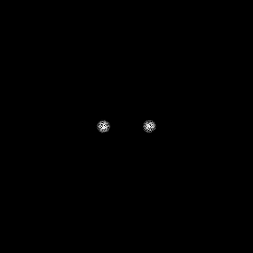

# Simple physic accurate light simulation



## Progress
- [x] Camera obscura (center of the world, all object will be calculated relative to the camera).
- [x] Light particles (photons) and light sources (stars).
- [ ] Mass and gravity.
- [ ] Black holes.
- [ ] Use wgpu for calculation.
- [ ] realtime rendering? (maybe not).

## How to run
```bash
cargo run
```
